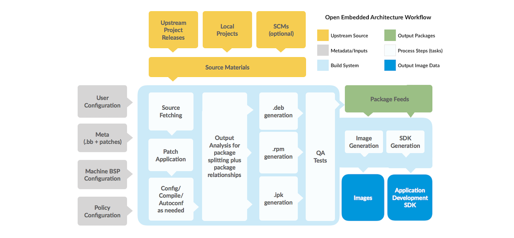

### Definitions

Terminology in the Yocto Project can be a little confusing. These definitions should help you along the way:

- **OpenEmbedded**: build system and community
- **The Yocto Project**: umbrella project and community
- **Metadata**: files containing information about how to build an image
- **Recipe**: file with instructions to build one or more packages
- **Layer**: directory containing grouped metadata (start with “meta-”)
- **Board support package (BSP)**: layer that defines how to build for board (usually maintained by vendor)
- **Distribution**: specific implementation of Linux (kernel version, rootfs, etc.)
- **Machine**: defines the architecture, pins, buses, BSP, etc.
- **Image**: output of build process (bootable and executable Linux OS)

### Block Diagram

